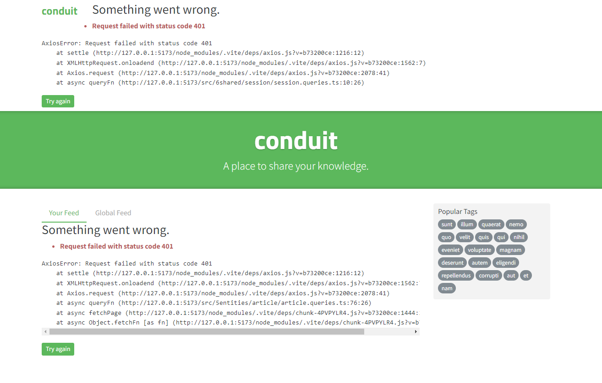

## Erro "Request failed with status code 401"

Caso você encontre esse erro:

Faça o procedimento a seguir:

- Abra o seu DevTools na aba "Application";
- No menu lateral, na seção "Storage", expanda o item "Local Storage" e clique em "http://localhost:5173";
- Repare que um item chamado "session" é exibido. Essa é uma variável que o app armazena e usa para controlar a interface;
- Delete esse item "session";
- Atualize a página e o erro desaparecerá.